# Sécurité des réseaux sans fil

## Laboratoire 802.11 Sécurité WPA Entreprise

__A faire en équipes de deux personnes__

**Equipe: Michaël da Silva, Nenad Rajic**

### Objectif :

1.	Analyser les étapes d’une connexion WPA Entreprise avec une capture Wireshark
2.	__(optionnel)__ Implémenter une attaque WPE (Wireless Pwnage Edition) contre un réseau WPA Entreprise
1.  __(optionnel)__ Implémenter une attaque GTC Dowgrade contre un réseau WPA Entreprise

## Partie 1: Analyse d’une authentification WPA Entreprise

Dans cette première partie, vous allez analyser [une connexion WPA Entreprise](files/auth.pcap) avec Wireshark et fournir des captures d’écran indiquant dans chaque capture les données demandées.

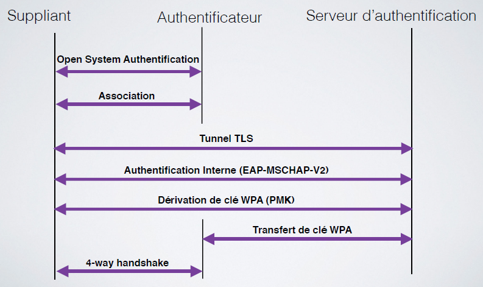

- Requête et réponse d’authentification système ouvert

  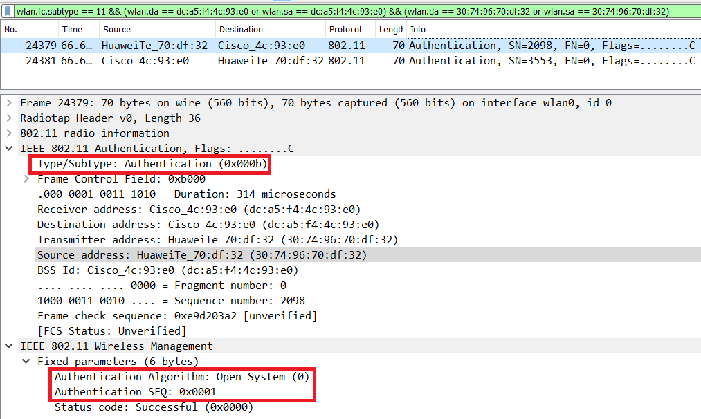

  Dans cette capture, on peut voir les deux requêtes d'Authentification envoyé entre l'AP et le client. Et ces deux trames sont de type **Authentification** et en **Open System**.

  

  - Requête et réponse d’association (ou reassociation)

  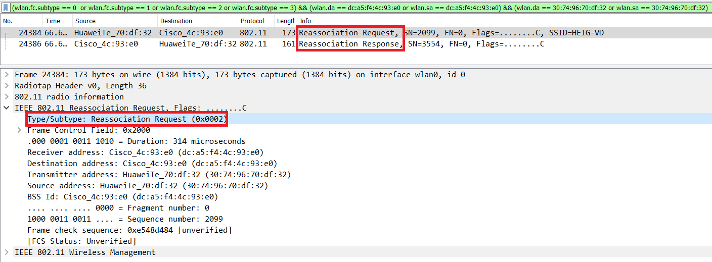

  En filtrant les paquets correctement, les trames de **Reassociation Request/Response** sont affichées.

- Négociation de la méthode d’authentification entreprise

  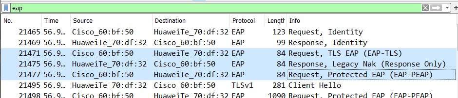

  On voit que l'AP a proposé au client d'utiliser **EAP-TLS** comme authentification mais le client a refusé cette offre avec un **Legacy Nak**. Alors l'AP renvoie une offre avec cette fois-ci **EAP-PEAP**.

- Phase d’initiation. Arrivez-vous à voir l’identité du client ?

  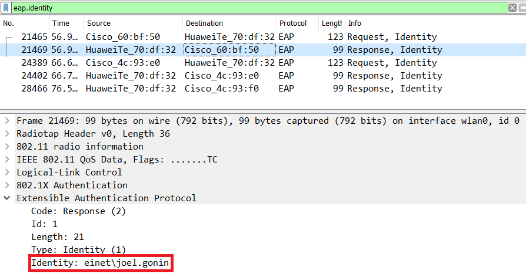

  On peut connaître l'identité du client grâce à la **Response Identity**. Ici, le client est Joel Gonin.

- Phase hello :

  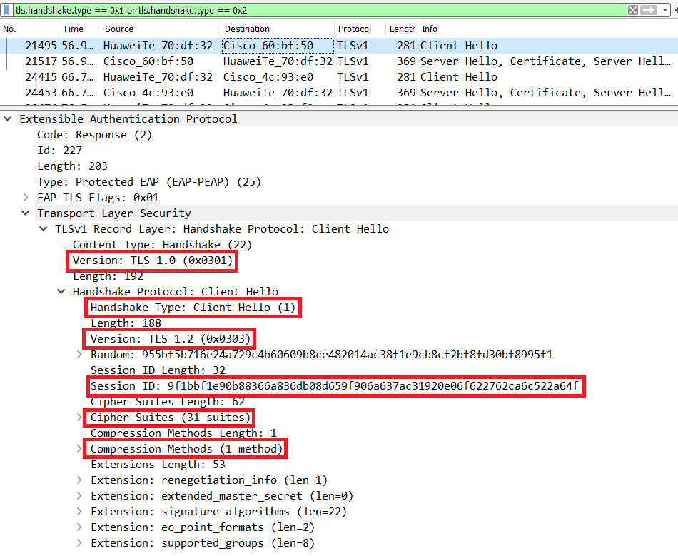

  Ici se montre la trame `Client Hello` dans la phase hello. Elle comprend comme informations la version TLS utilisée, les Ciphers Suites et Compression Methods, le Nonce du client et le Session ID.  

  - Version TLS 

    Ici version 1.0 utilisé entre le client et le serveur, 1.2 accepté par le client

  - Suites cryptographiques et méthodes de compression proposées par le client et acceptées par l’AP

    `Proposé par le client:`

    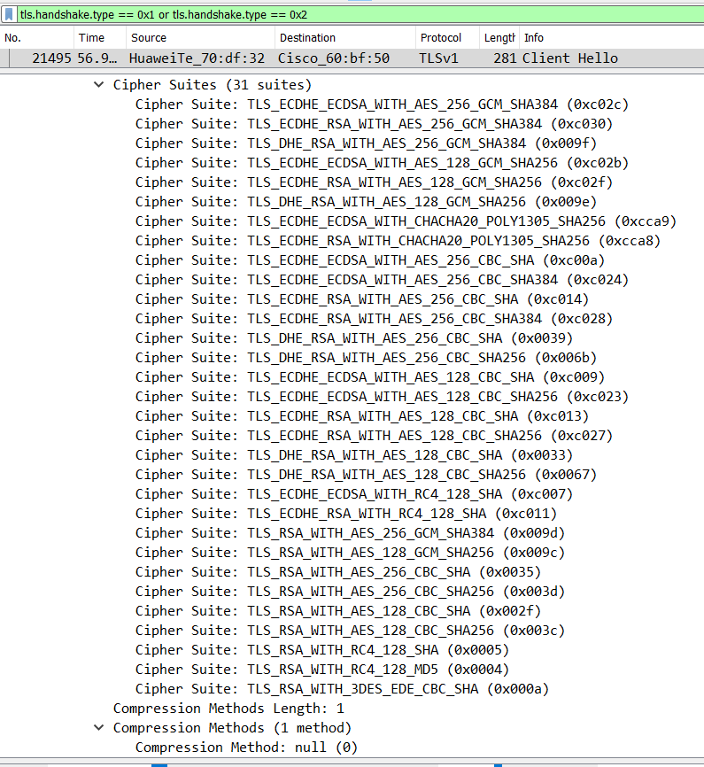

    `Accepté par le serveur:`

    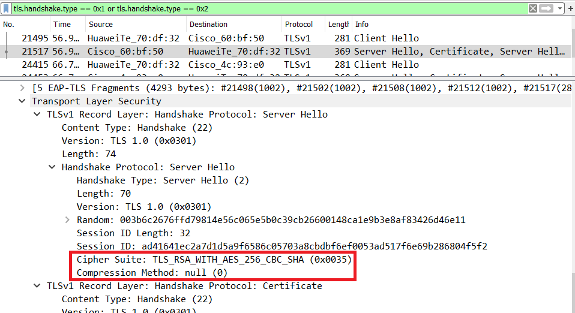

  - Nonces

    `Nonce client:` 955bf5b716e24a729c4b60609b8ce482014ac38f1e9cb8cf2bf8fd30bf8995f1

    `Nonce server:`  003b6c2676ffd79814e56c065e5b0c39cb26600148ca1e9b3e8af83426d46e11

  - Session ID

    `Session ID client:` 9f1bbf1e90b88366a836db08d659f906a637ac31920e06f622762ca6c522a64f

    `Session ID server:` ad41641ec2a7d1d5a9f6586c05703a8cbdbf6ef0053ad517f6e69b286804f5f2

- Phase de transmission de certificats

    - Echanges des certificats

    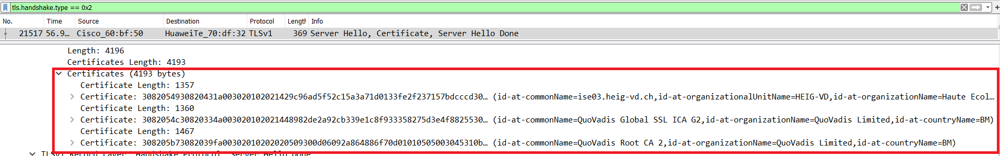

    Les certificats du serveur sont disponibles dans la trame recomposée `Server Hello, Certificate, Hello Done`.

  - Change cipher spec

    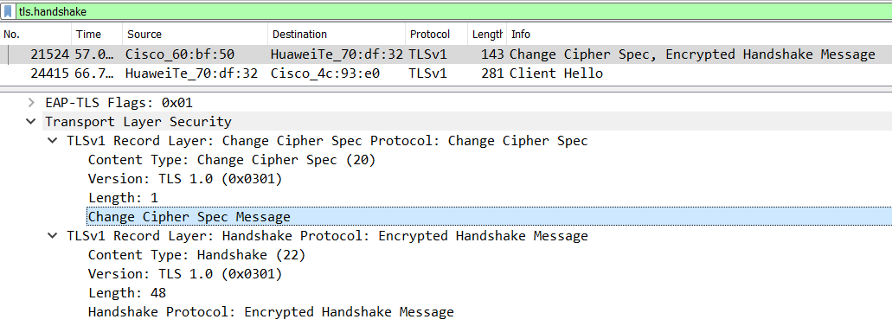

- Authentification interne et transmission de la clé WPA (échange chiffré, vu comme « Application data »)

  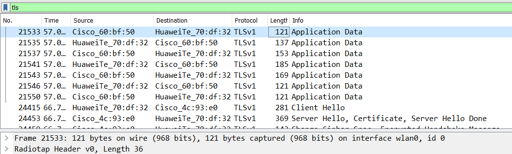

- 4-way handshake

  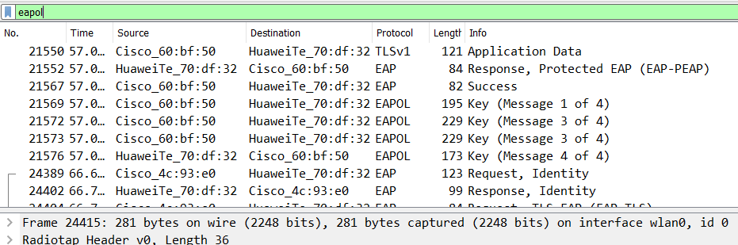

### Questions:

> **_Question :_** Quelle ou quelles méthode(s) d’authentification est/sont proposé(s) au client ?
> 
> **_Réponse :_** Le client propose comme méthode d'authentification EAP-TLS.

---

> **_Question:_** Quelle méthode d’authentification est finalement utilisée ?
> 
> **_Réponse:_** Le serveur refusant la méthode proposée par le client, il propose alors la méthode EAP-PEAP qui est la solution choisie.

---

> **_Question:_** Lors de l’échange de certificats entre le serveur d’authentification et le client :
>
> - a. Le serveur envoie-t-il un certificat au client ? Pourquoi oui ou non ?
>
> **_Réponse:_** Oui, il en envoie 3 différents afin de prouver son identité auprès du client et cela permet d'éviter des attaques Man-in-the-Middle.
>
> - b. Le client envoie-t-il un certificat au serveur ? Pourquoi oui ou non ?
>
> **_Réponse:_** Non car la méthode choisie (EAP-PEAP) ne nécessite pas l'envoi de certificats par le client pour s'authentifier mais via des identifiants comme trouvé plutôt.

## Livrables

Un fork du repo original . Puis, un Pull Request contenant :

-	Captures d’écran + commentaires
-	Réponses aux questions

## Échéance

Le 9 juin 2021 à 23h59